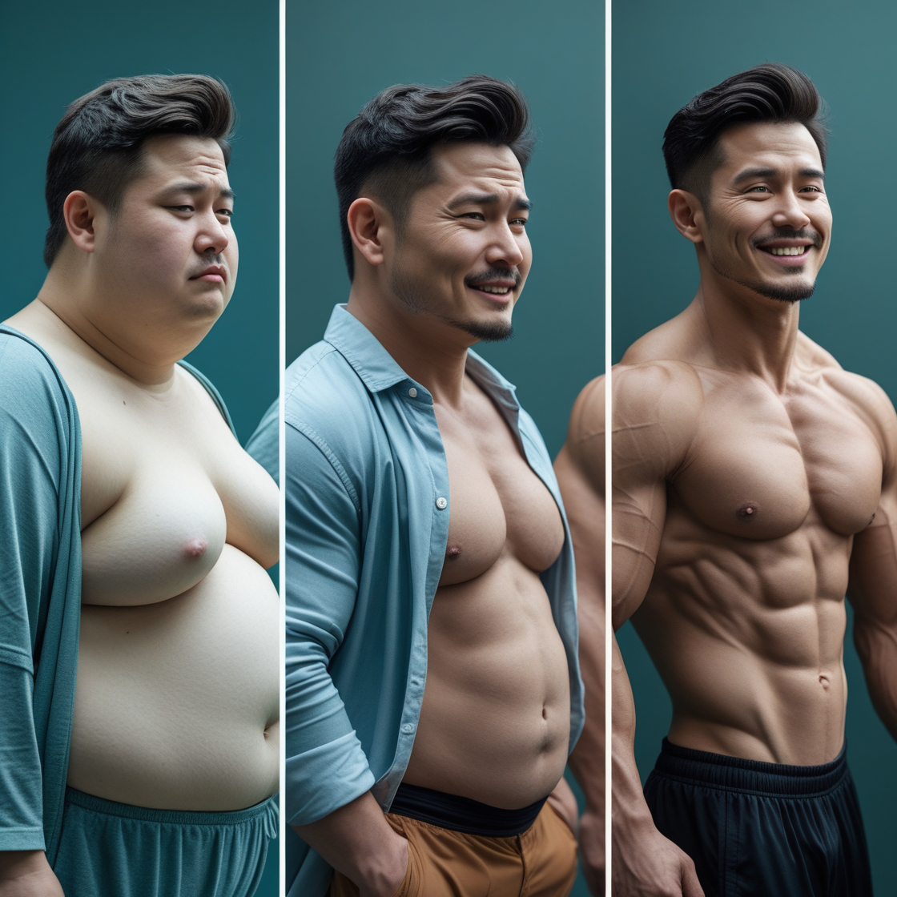

# Ivan's Fitness - Your Path to a Healthier Life

## Introduction

Welcome to Ivan's Fitness, a website dedicated to helping individuals achieve their fitness goals and adopt a healthy lifestyle. Whether you're looking to lose weight, build muscle, or simply improve your overall well-being, this website provides essential resources, workout plans, and nutrition tips to guide you on your journey.

This project was created to inspire and educate people about the benefits of a healthy lifestyle through structured exercise routines, balanced nutrition, and motivational transformations. The website also features before and after transformations, showcasing real-life results achieved through dedication and consistency.

## Navigation Menu

The website includes a user-friendly navigation bar that ensures smooth browsing and easy access to all major sections. The navigation menu consists of the following links:

- Home – Takes users back to the homepage.
- Introduction – Provides an overview of the website’s purpose and what users can expect.
- BMI Calculator – Allows users to calculate their BMI and get fitness recommendations based on their results.
- Workout Plans – Offers tailored workout programs for different fitness goals.
- Transformations – Showcases real-life before and after transformations to motivate users.
- Contact – A section where users can reach out for personalized fitness advice or inquiries.

The navigation bar remains fixed at the top for easy access and is styled with a modern, clean design that aligns with the website’s green and white color scheme.

## Transformation Section

One of the most powerful sections of Ivan's Fitness is the Transformation Section, which visually demonstrates the incredible results that can be achieved through discipline, hard work, and the right fitness plan.

### Why This Section Matters?

- Seeing real transformations is one of the best ways to stay motivated.
- It helps users believe in themselves and understand that change is possible.
- It provides proof that the workouts and nutrition plans featured on the website truly work.

### What You’ll Find Here

- Before & After Photos – Showcasing individuals who have transformed their bodies through consistent training and a healthy diet.
- Success Stories – Testimonials from people who have followed fitness plans from Ivan's Fitness.
- Tips & Guidance – Key insights on how to stay motivated and overcome common obstacles in the fitness journey.

(assets/images/before-after-2.png)

## BMI Calculator

The BMI (Body Mass Index) Calculator is an interactive tool that allows users to assess their body composition. By entering their height and weight, users receive their BMI score along with a fitness category:

- Underweight – Suggested workout plans to gain healthy weight and build muscle.
- Normal Weight – Maintenance plans to stay fit and improve endurance.
- Overweight – Fat-burning programs and nutrition tips for sustainable weight loss.
- Obese – A structured plan focusing on gradual weight loss and improving overall health.

Once users receive their BMI results, they are directed to the Workout Plans Section, where they can find the best exercises tailored to their category.

## Workout Plans Section

This section provides detailed workout programs designed for different fitness levels and goals. Each plan includes:

- Types of exercises – Strength training, cardio, flexibility, and HIIT workouts.
- Training frequency – Recommended number of workouts per week.
- Nutrition advice – Healthy eating guidelines to complement the fitness journey.
- Hydration & recovery tips – Importance of staying hydrated and getting enough rest.

The workouts are structured to cater to beginners, intermediate, and advanced individuals, ensuring that everyone has a program that suits their needs.

## Contact Section

The Contact Form allows users to reach out for personalized fitness advice, inquiries, or collaborations. It collects the following details:

- Name
- Email Address
- Message (Inquiry/Question)

Upon submission, users receive a confirmation message:
"Thank you for contacting me! I will get back to you within 2–4 days. For urgent requests, please email me directly."

This ensures effective communication and provides an easy way for users to seek professional guidance.

## Footer Section

The footer contains essential links and contact information, including:

- Copyright Information – © 2024 Ivan's Fitness. All Rights Reserved.
- Email Contact – A direct link to the author’s email for inquiries.
- Social Media Links – Icons for Instagram, Facebook, and YouTube, encouraging users to follow for more fitness tips and motivation.

The footer design is kept minimal and clean, ensuring a consistent branding across all pages.

## Existing Features

- Responsive Design – The website adapts perfectly to different screen sizes (desktop, tablet, and mobile).
- BMI Calculator – Users can easily calculate their BMI and receive personalized fitness recommendations.
- Workout Plans – Structured training programs for weight loss, muscle gain, and overall fitness.
- Transformation Gallery – Inspiring before and after images to motivate users.
- Contact Form – Simple and effective way to get in touch.
- Navigation Bar – Fixed menu for easy access to all sections.
- Custom 404 Page – A user-friendly error page for a seamless browsing experience.
- Social Media Integration – Direct links to fitness content on Instagram and Facebook.

## Planned Features

- Interactive Progress Tracker – A feature that allows users to track their workouts, weight changes, and progress over time.
- Nutrition Meal Plans – Personalized diet plans based on BMI and fitness goals.
- Video Workouts – A library of guided workout videos for proper exercise form and techniques.
- Dark Mode Option – A toggle for users who prefer a darker interface.
- User Accounts & Fitness Challenges – Community-based challenges where users can compete and track their fitness journey.

## Technologies Used

- HTML5 – Structure and content.
- CSS3 – Styling and responsive design.
- JavaScript – Interactivity and dynamic elements.
- Git & GitHub – Version control and project hosting.
- Favicon – A custom fitness-themed favicon for branding.

## Testing & Validation

The website has undergone extensive testing to ensure functionality, accessibility, and responsiveness:

- Cross-browser compatibility – Works seamlessly on Chrome, Firefox, Safari, and Edge.
- Responsive design tests – Ensures all sections adapt correctly on different screen sizes.
- Form validation – The Contact Form has been tested to ensure proper submission handling.
- Performance optimization – Images and assets are optimized for faster loading times.
- W3C Validation – The HTML and CSS code has been validated to meet web standards.

## Deployment

The website has been deployed using GitHub Pages, making it accessible across all devices. The steps for deployment included:

1. Pushing the code to a GitHub repository.
2. Enabling GitHub Pages in the repository settings.
3. Selecting the main branch for deployment.
4. Accessing the live website via the provided GitHub Pages URL.

## Acknowledgments

This project was developed as part of Ivan's Fitness, with inspiration drawn from real-life fitness success stories.

Special thanks to:

- The fitness community for motivation and shared knowledge.
- The Code Institute community for technical guidance.
- Friends and family for continuous support and feedback.

🚀 Are you ready to transform your body and mind? Start your journey today with Ivan's Fitness! 💪🔥