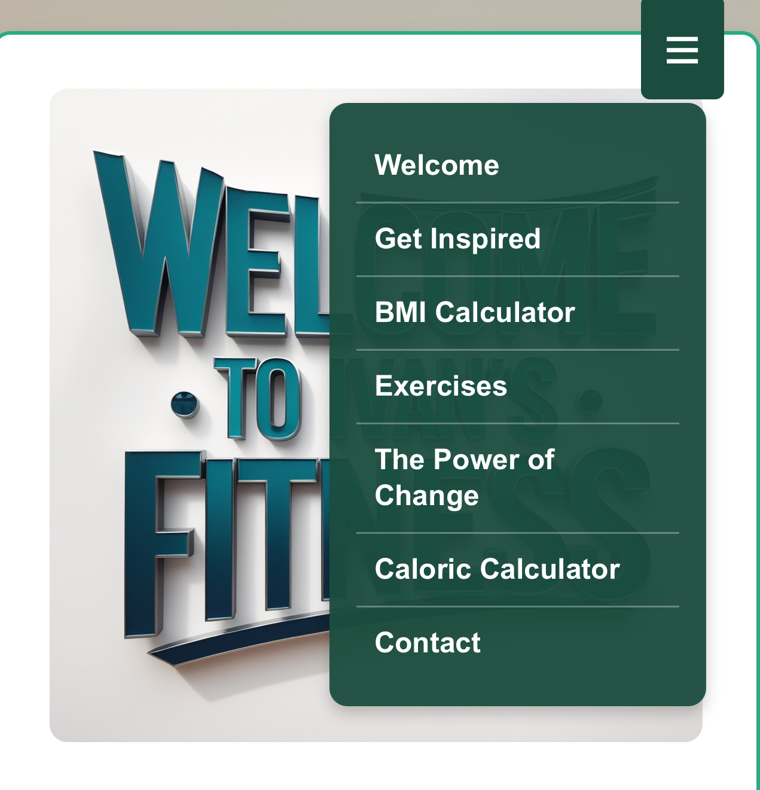
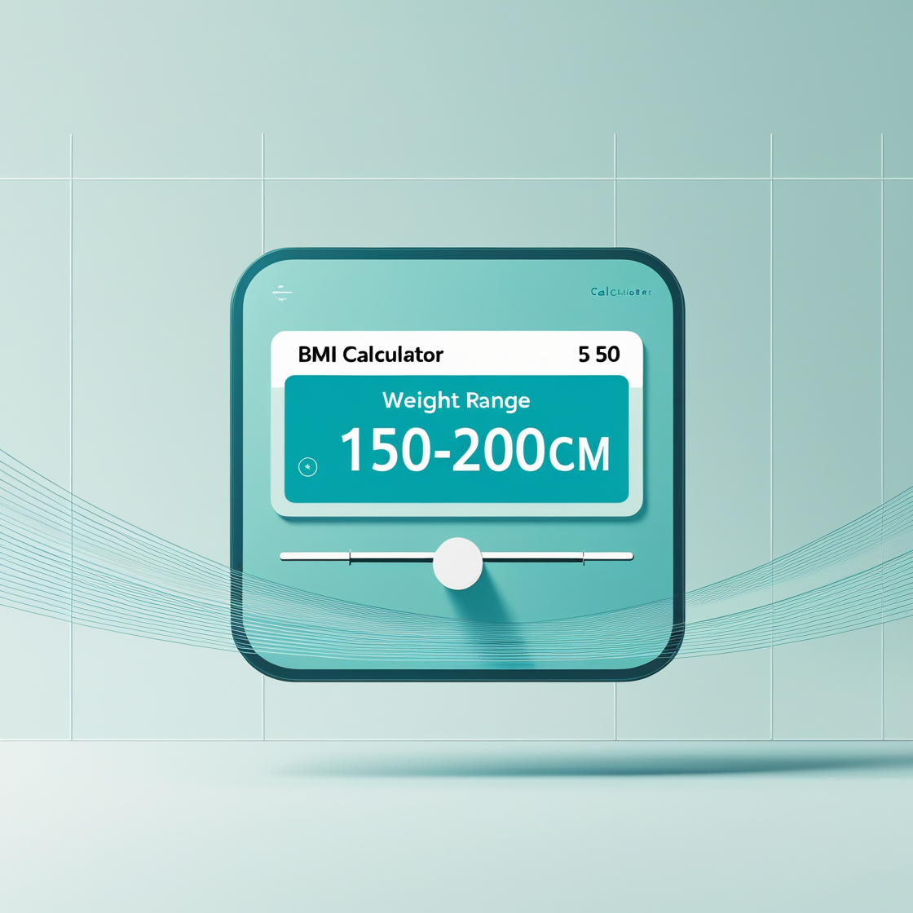
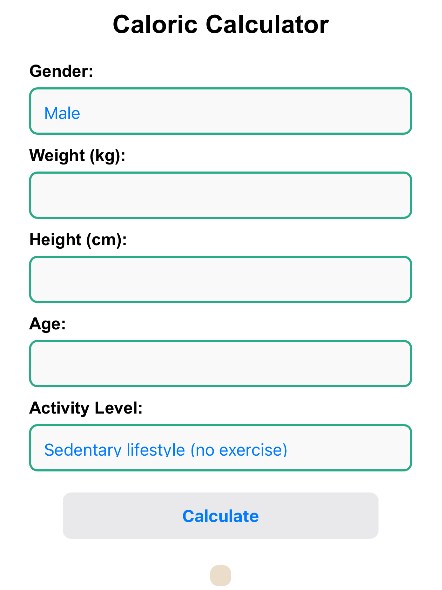
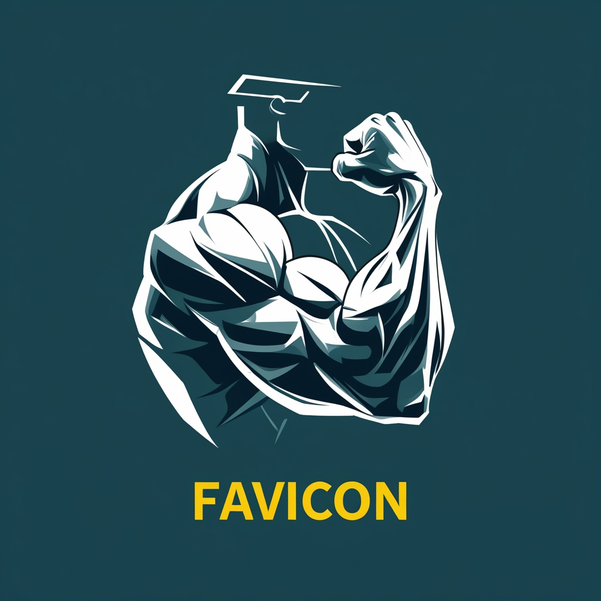
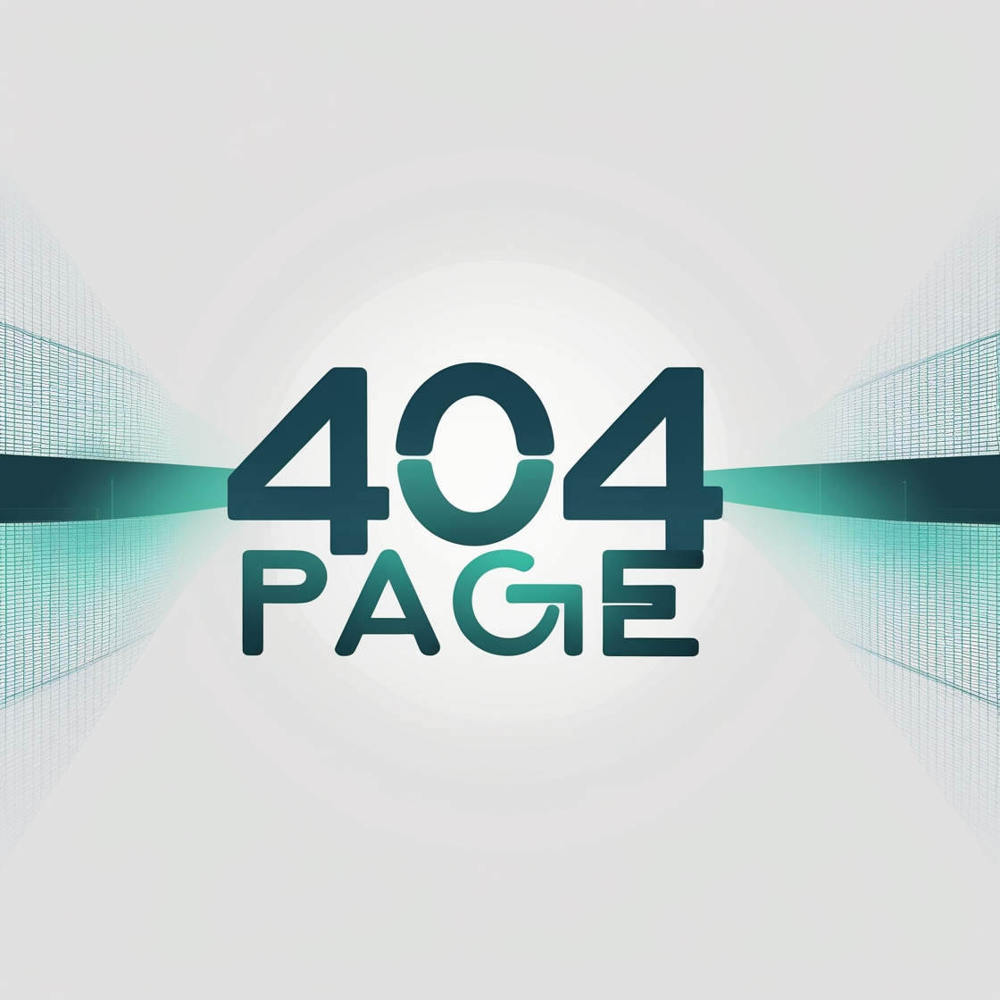
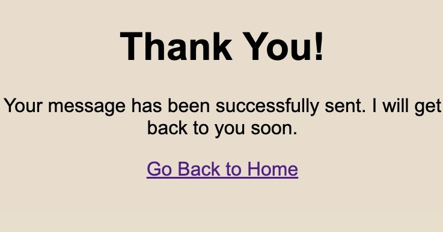
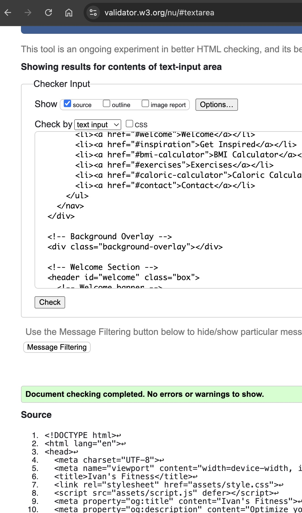
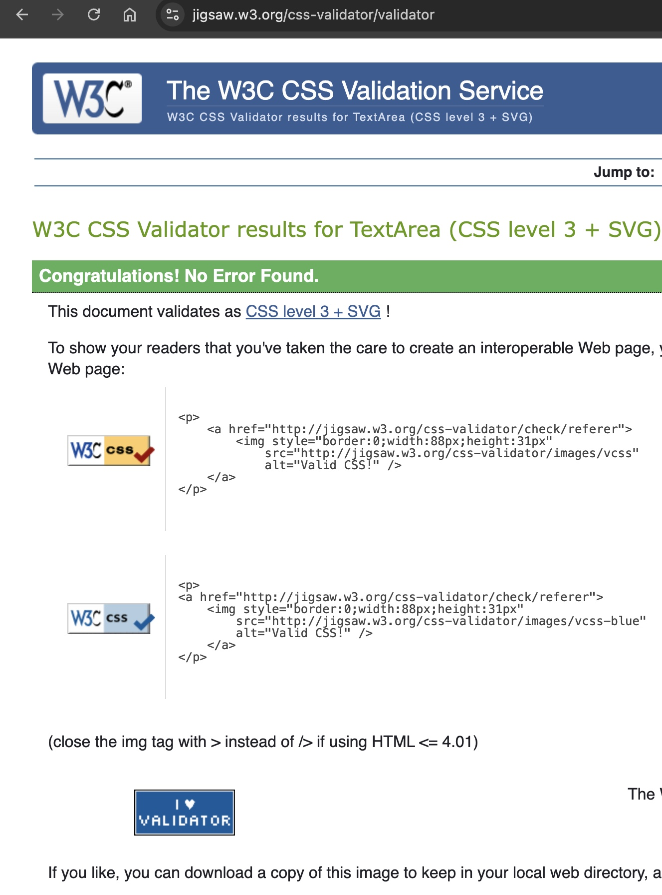
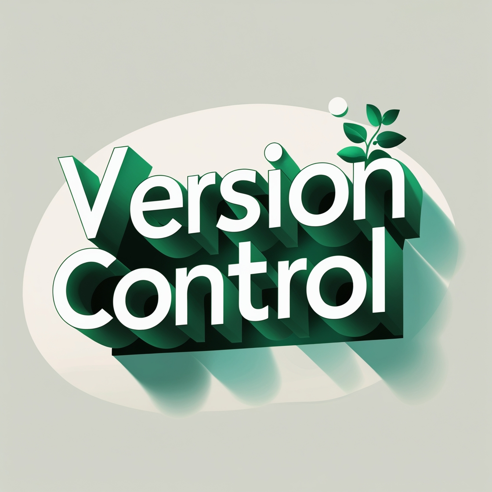
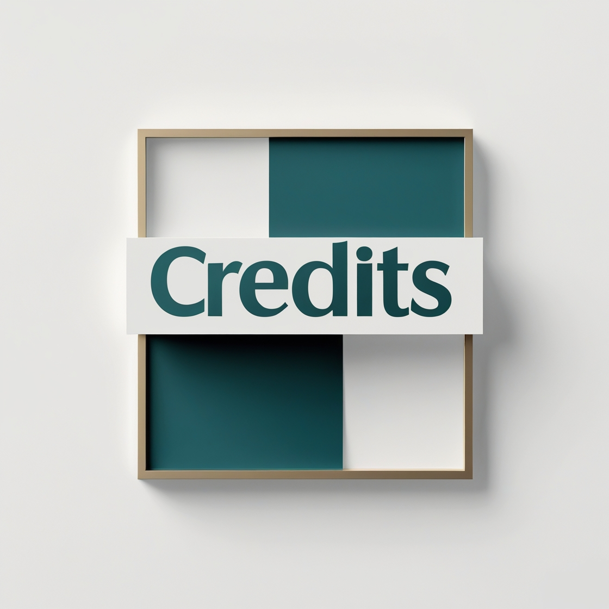

# Ivan's Fitness - Your Path to a Healthier Life

## Introduction 
Welcome to **Ivan's Fitness**, a web application designed to help individuals achieve their fitness goals through structured workout plans, interactive calculators, and motivational content. This platform provides users with essential tools such as a **BMI Calculator** and a **Caloric Calculator**, helping them tailor their fitness journey based on personalized data.

This project aims to educate and inspire users to maintain a **healthy lifestyle**, offering custom workout plans and nutritional guidance for different body types. By integrating interactive elements, real-life transformation stories, and user-friendly features, **Ivan’s Fitness** is more than just a fitness guide – it’s a step towards a **better you**.

---


## About the Project

The **Ivan’s Fitness** project was built to address the common challenges people face in achieving fitness goals. It provides **personalized workout plans** based on BMI categories and caloric needs, making it easier for users to understand how to train and eat correctly. The website includes a **BMI Calculator**, a **Caloric Calculator**, and a dedicated section for workout plans tailored to different fitness levels.

### Key objectives of the project:
- Offer **interactive fitness tools** to help users make informed health decisions.
- Provide **structured workout plans** based on **BMI results**.
- Ensure **responsive design**, making it accessible across all devices.
- Inspire users with **real-life transformations** and practical fitness advice.
- Integrate **email confirmation** after form submission for better user engagement.

This project was developed using **HTML, CSS, and JavaScript**, deployed via **GitHub Pages**, and tested for **performance, accessibility, and cross-browser compatibility**.

---


## Navigation Menu 


The website includes an **intuitive and responsive navigation menu** that allows users to explore various sections easily. The navigation bar includes:

- **Home** – The main landing page with an overview of the website.
- **Get Inspired** – A section with motivational content.
- **BMI Calculator** – A tool to assess body composition and suggest workout plans.
- **The Power of Change** – A motivational section encouraging personal transformation through fitness and a healthy lifestyle.
- **Exercises** – A section with exercise recommendations based on BMI.
- **Caloric Calculator** – A tool to calculate daily caloric intake requirements.
- **Contact** – A section where users can reach out for personalized fitness guidance.


---

## BMI Calculator 




The **BMI Calculator** is a fundamental tool on the **Ivan’s Fitness** platform, helping users assess their **body composition** and determine their **fitness category**. By entering **height and weight**, users receive an instant **Body Mass Index (BMI) score**, which categorizes them into one of several groups:


✅ **Underweight** – Focus on **muscle gain** and **nutrient-rich diet**.  

✅ **Normal Weight** – Maintain a **balanced** exercise routine.  

✅ **Overweight** – Implement **fat-burning** workouts and **healthy eating habits**.  

✅ **Obese** – Prioritize **low-impact exercises** and **gradual weight loss strategies**.  


The calculator is **simple and user-friendly**, requiring only two inputs: **weight (kg)** and **height (cm)**. After pressing the **Calculate** button, the system processes the data and provides a **clear BMI result** along with a **category description**. This **guides users** toward an **effective and personalized workout plan**.


### 💡 Interactive Workout Highlighting

✔️ The system **highlights** the **most suitable workout plan** for the user.  

✔️ The **corresponding exercise category turns yellow**, providing a **clear visual cue**.  

✔️ Users can easily **navigate** to their **personalized fitness plan** without confusion.  


📌 **Regular use of the BMI Calculator** helps users **track progress** as their **weight and body composition** change over time.


---


## Exercises for You 

One of the most **unique features** of the **Ivan’s Fitness** platform is the **interactive exercise recommendation system**. This feature ensures that users **don’t need to guess** which workout plan **suits them best**—the platform does it **automatically**. After users calculate their BMI, the **most appropriate exercise plan** is **highlighted in yellow**, making it **easy to identify** the best training approach for their needs.


### 🔍 How It Works:

1️⃣ **User inputs height and weight** into the **BMI Calculator**.  

2️⃣ The system **calculates BMI** and assigns a **category** _(e.g., Underweight, Normal, Overweight)_.  

3️⃣ The **corresponding workout card turns yellow**, visually guiding users to their **recommended exercise plan**.  

4️⃣ The user can explore **detailed workout routines**, including:

   - 🏋️ **Exercise frequency** – How often to train for best results.  

   - 🍏 **Nutrition tips** – Meal recommendations based on body goals.  

   - 💧 **Hydration advice** – Daily water intake recommendations.  

   - 😴 **Recovery recommendations** – Rest and sleep strategies.  


By following the **recommended plan**, users can see **better results** and stay committed to their **fitness journey** without feeling overwhelmed.

---



## Caloric Calculator 

A key aspect of any **fitness journey** is managing **caloric intake**. The **Caloric Calculator** helps users determine their **daily energy requirements** based on:
- **Gender** (Male/Female)
- **Weight** (kg)
- **Height** (cm)
- **Age** (years)
- **Activity level** (sedentary to highly active)

Once users input their details, the calculator provides an estimate of **daily caloric needs**, helping them understand how much they should eat to maintain, gain, or lose weight.

---


## Favicon
A **custom favicon** was implemented to enhance branding and improve user experience. The favicon:
- Helps users quickly identify the website in browser tabs.
- Maintains **visual consistency** with the website’s theme.
- Improves the overall **professionalism** of the project.

The favicon is stored in the `assets/favicon/` directory and applied in the HTML `<head>` section.

---


## 404 Page 
A **custom 404 page** was created to handle cases where users access a **non-existent page**. This page:
- Displays a friendly **error message**.
- Provides a **redirect link** back to the homepage.
- Ensures a **better user experience** by preventing confusion.

The `404.html` file is included in the root directory for seamless integration.

---


## Contact Form 

The **Contact Form** allows users to send inquiries or request personalized fitness guidance.

### Features:
- **User Inputs**: Name, Email, and Message.
- **Form Validation**: Ensures all fields are correctly filled before submission.
- **Email Confirmation**: Users receive an **automatic confirmation email** after submission.
- **Success Message**: After sending, users see a notification: _"Your email has been sent successfully!"_

This ensures smooth communication and enhances **user engagement**.

---



## Thank You Page 

After submitting the **contact form**, users are redirected to a **Thank You page**, confirming that their message has been received. This page:
- Acknowledges the user’s submission.
- Encourages further engagement with the website.


---


## Design 

The design philosophy of **Ivan’s Fitness** focuses on **clarity, motivation, and accessibility**. The color scheme includes:
- **Green (#4CAF50)** – A calming and health-focused color.
- **White (#FFFFFF)** – Clean and modern aesthetics.
- **Black (#000000)** – High contrast for readability.

---

## Technologies Used 💻
- **HTML5** – Structural foundation.
- **CSS3** – Styling and responsive design.
- **JavaScript** – Interactivity and logic.
- **Git & GitHub** – Version control and deployment.

---


## Testing & Validation 

The project was tested using **W3C validation tools** to ensure **HTML, CSS, and JavaScript** meet web standards.

HTML validation 


CSS validation


The **JavaScript** code used in this project was tested using **JSHint**, a widely recognized JavaScript code quality tool.  
**Result:** ✅ No errors were detected.

### Key Testing Points:
- ✅ **Accessibility** – Verified using Lighthouse for web standards compliance.
- ✅ **Functional Testing** – Ensured all interactive elements work correctly.
- ✅ **Cross-Browser Compatibility** – Tested on Chrome, Firefox, and Edge.

---


## Deployment  

The project was **deployed on GitHub Pages** following these steps:  

1. **Code pushed to GitHub Repository**.  
2. **GitHub Pages enabled** in repository settings.  
3. **Live link generated for public access**.  

### Run Locally 
To run this project on your local machine:
1. Clone the repository:  
   ```bash
   git clone https://github.com/bobes81/fitness-project.git


The website is available at:  
🔗 **[Ivan's Fitness Live Version](https://bobes81.github.io/fitness-project/)**

---


## Version Control  

- The project was developed using **VS Code**.  
- Version control was managed via **Git & GitHub**.  
- Changes were tracked using **meaningful commit messages**.  
---




## Credits 
- **Development:** Ivan Kimpl
- **Mentorship:** Gareth Mc Girr
- **Resources:** Code Institute, W3C Validators, Mozilla Dev Docs
- **AI-Generated Images**: All images used in this project were created using AI tools to ensure originality and avoid copyright concerns.
- **ChatGPT Assistance**: This project also benefited from ChatGPT’s guidance, which provided support in structuring content, debugging, and improving the overall user experience.
